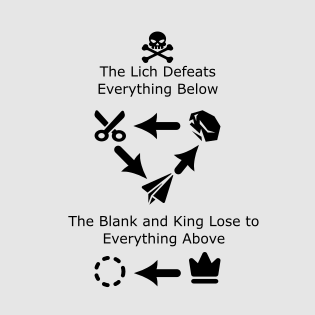

In Block Paper Scissors you lead a ragtag group of stalwart dice as they face off against dangerous opponents in a game of chance and skill.

Lead your dice with varying abilities into battle against several types of challenging opponent. Take full advantage of your enemies tactics and view what actions the enemy plans to take before you move. Learn to exploit the strengths and weaknesses of different combinations and fight across 5 different battlefields. Oh, and if your king dies it's game over.

Roll your way to victory in this puzzler strategy game inspired by titles like Into the Breach, Golf Peaks, Chess, and strategy classic Rock Paper Scissors.

## How to play
- The goal is to defeat all enemy dice.
- Move each of your dice into position, and then the enemies will move.
- Each die ***must move its full amount***.
- Dice roll as they move, so plan which face lands up.
- If an enemy is adjacent to your die, a winner will be determined and the losing die removed.
- The enemies show where they plan to move, so you can move beside their path to defeat them when they move.
- And very importantly, if you have a KING and it dies, YOU LOSE.
- Take a look at this chart to see what beats what:

## Controls
- Left click - select a die to move, or select an enemy to see where they will move
- Right click - move your selected die
- Hold space - Show all enemy movements

## Tips
- The ghosts show the orientation that a die will be in after moving.
- Changing the order of your moves affects which face will be up. Left and up does not have the same result as up and left.
